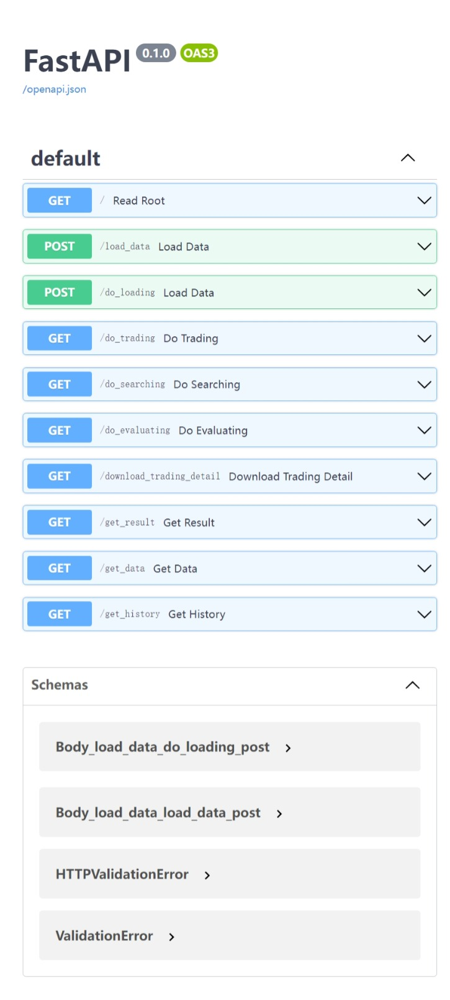
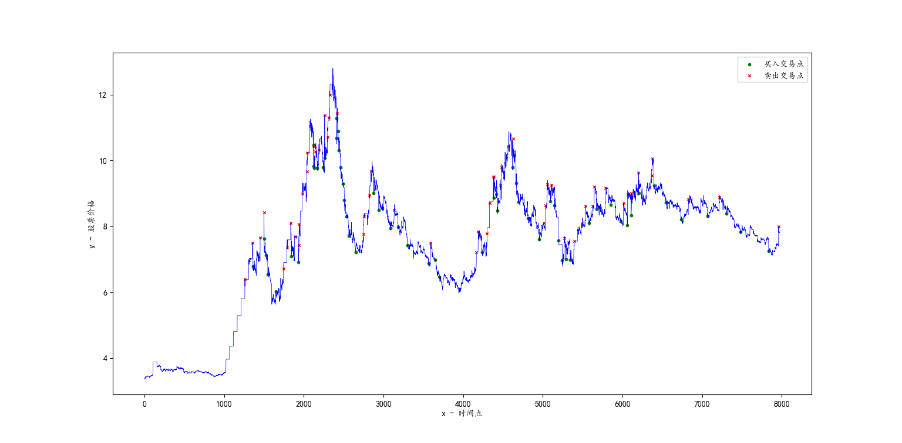
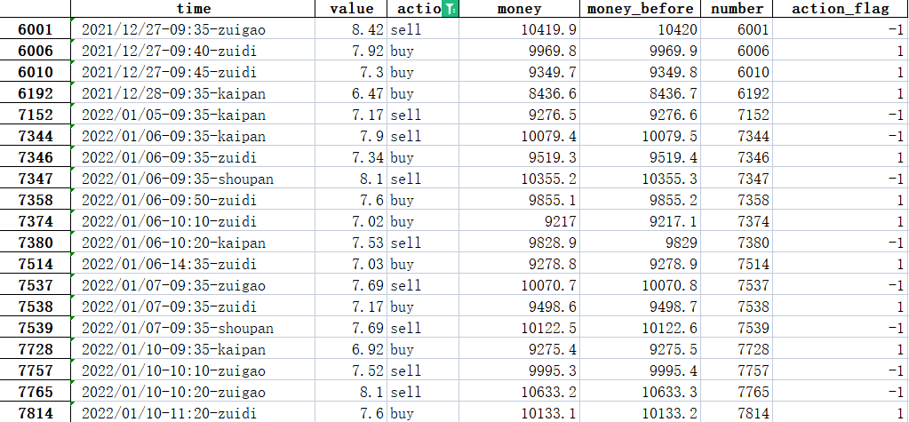

# grid-trading-system
网格交易系统，应用于股票，基金，外汇等场景，支持模拟交易、参数搜索、回测等功能。

## ❤️️🌈⭐️🌳🎉🌟

❤️️🌈喜欢的话，不妨“点石成金”点个 Star ⭐️，“携手并进” Fork 🌳 一下，感谢🎉🌟！


## 接口

部署服务后，进入接口文档地址查看各个接口服务的用法。

### 接口文档

- docs: http://127.0.0.1:8080/docs
- redoc: http://127.0.0.1:8080/redoc

### 接口列表



### 接口请求示例

)

## 网格交易

- [grid_handler.py](grid_trading/grid_handler.py)
- 实现传入股票数据的Excel文件，模拟买卖基金或股票的过程，计算盈亏状态。

### 模拟华泰网格交易做回测

导入K线表的数据，然后模拟华泰网格交易的过程，计算交易过程和最终的总价值。

- 参数设置：

```
:param shuju: 股票所有数据
:param touruzijin: 投入资金
:param jizhunjia: 基准价格，设置为0则为回测的第一个数据
:param dancifene: 买入卖出单次交易股数，等股交易
:param jiancangfene: 起始建仓股数
:param wanggeshangjie: 网格上界
:param wanggexiajie: 网格下界
:param wanggeleixing: 网格类型，1为差价，2为百分比
:param mairuyuzhi: 买入阈值，差价或百分比
:param maichuyuzhi: 卖出阈值，差价或百分比
:param shouxufeilv: 手续费率，默认0.01%，0.1元起
```

- 交易规则：

```
在当前交易日（以差价网格为例）：
    如果 当时净值 > 基准价 + 网格大小：
        如果有足够份额，即 当日持有基金的份额 >= 单次份额 ，就卖出 单次份额 份基金，
            卖出：现金增加 (+当时净值 * 单次份额 - 手续费率 * 当时净值 * 单次份额 )，同时基金份额减少 单次份额 
            更新基准价 基准价 = 成交价
        如果没有足够的份额可以卖出 单次份额 份：
            无法卖出，躺平，不做任何操作
    如果 当时净值 < 基准价 - 网格大小：
        如果有足够的现金可以买入 单次份额 份，即 当时现金 >= 买入份额 单次份额 的基金对应净值数+手续费：
            买入：现金减少(-当时净值 * 单次份额 -手续费率 * 当时净值 * 单次份额 )，同时基金份额增加 单次份额 
            更新基准价 基准价 = 成交价
        如果没有足够的现金可以买入 单次份额 份：
            无法买入，躺平，不做任何操作
```

### 网格交易例子图示

### 湖北广电（000665）回测
- 时间段
  - 2021.11.11-2023.07.19

- 设置参数
```python
shuju=shoupan,  # 数据
touruzijin=10000,  # 投入总资金
jizhunjia=0,  # 基准价，0则以初始价为基准价
dancifene=100,  # 单次交易股数
jiancangfene=1000,  # 建仓股数
wanggeshangjie=12,  # 网格上界
wanggexiajie=6,  # 网格下界
wanggeleixing=1,  # 网格类型，1为差价，2为百分比
mairuyuzhi=0.5,  # 买入阈值
maichuyuzhi=0.5,  # 卖出阈值
shouxufeilv=0.0001,  # 手续费率
```

- 交易结果
  - 投入资金：10000，
  - 回报总价值：17342.759（其中现金：8740.759，份额价值：8602.000），
  - 盈亏比例：73.43%，年化为44.06%。

- 交易点图示


- 交易明细示例



### 构建docker镜像
```shell
sudo docker build -t grid_server:base . 
```

- 历史镜像
  - grid_server:base

### docker-compose部署
```shell
sudo docker-compose up -d
```
